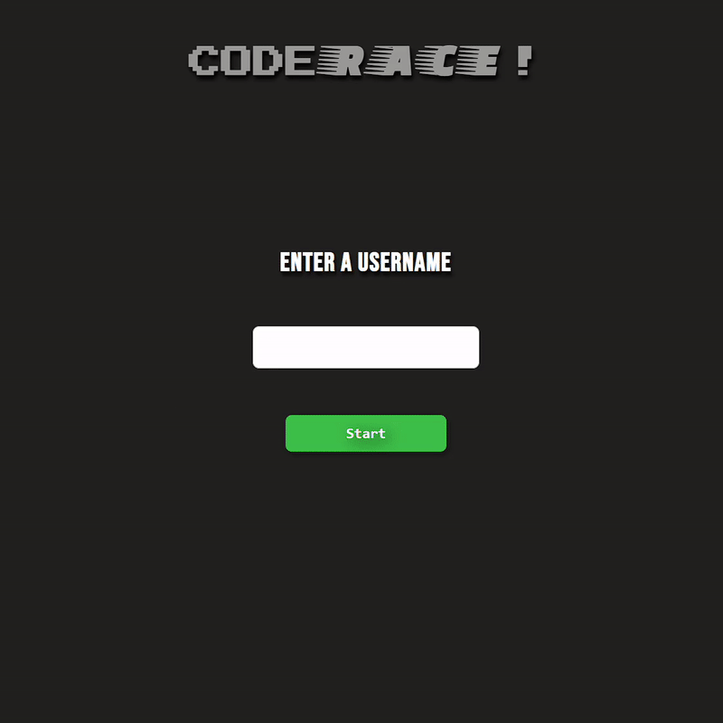

# Code Speed Typer 
[](https://code-race.netlify.app/)

Given a line of code how fast can you type it? Did you make any mistakes? Did you have to look down at your keyboard to look for that pesky pipe character? 

This app spits a random line of code on your screen and its your job to type it. It'll track how long it takes you to complete it and the number of mistakes you make. Practice with your friends on the same computer by refreshing the page and logging in with a different username. GLHF!

---
## Technologies Used

### Frontend
JavaScript | CSS | HTML

### Backend
Ruby on Rails | PostgreSQL

---
## Installation & Local Server
cd into the backend
```bash
bundle install && rails db:migrate && rails db:seed && rails s
```
Then open index.html in your browser of choice (Chrome is preferred)

---
## Contributing
Bug reports and pull requests are welcome on GitHub at https://github.com/IgoVeyner/code-speed-typer. This project is intended to be a safe, welcoming space for collaboration, and contributors are expected to adhere to the code of conduct.

---
## License
The app is available as open source under the terms of the MIT License. https://opensource.org/licenses/MIT

---
## Code of Conduct
Everyone interacting in the project's codebases, issue trackers, chat rooms and mailing lists is expected to follow the code of conduct.

Ruby version: 2.6.1
